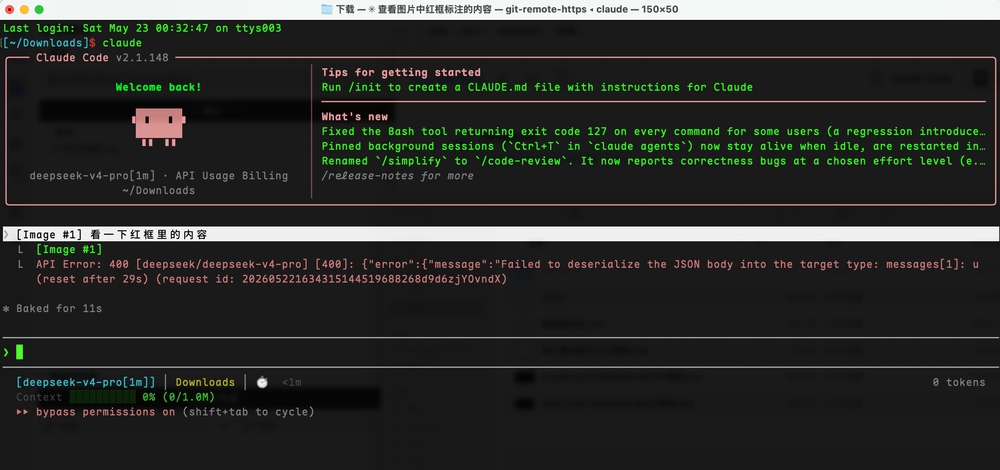
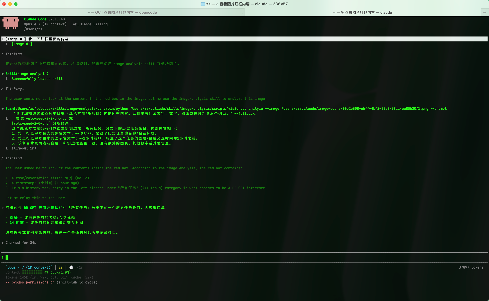
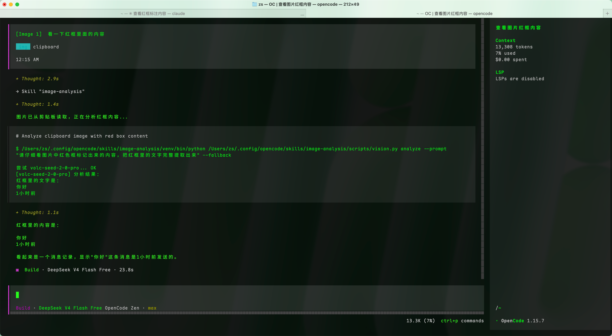
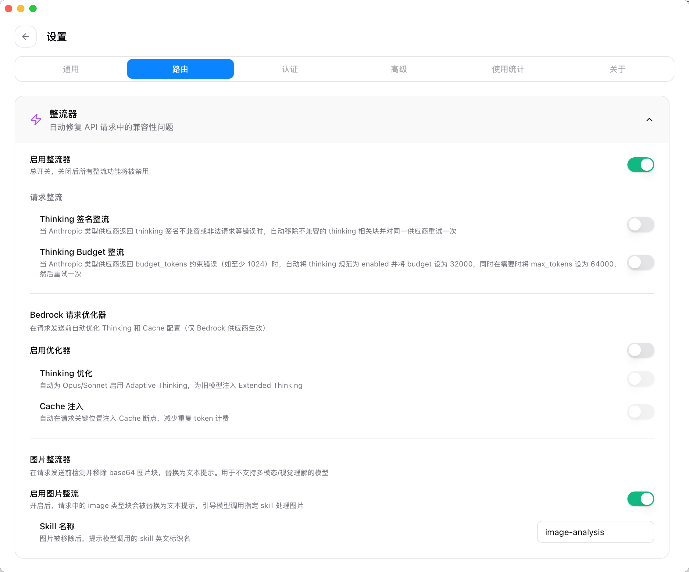

# CC Switch（增强分支）

**[CC Switch](https://github.com/farion1231/cc-switch) 的增强分支 — 为 AI CLI 工具新增图片整流器和多 Provider 视觉分析技能。**

[English](README_ZH.md) | 中文 | [日本語](README_JA.md)

---

## 为什么需要本项目？

**AI CLI 工具 + 第三方模型 = 图片理解真空地带。** 这是 Claude Code、OpenCode 等工具搭配 DeepSeek 等不支持多模态的模型时，最让人头疼的问题。

### 传统方案的死结

常见的做法是在全局 `CLAUDE.md` 中写规则，强制要求使用某个 Skill 或 MCP 去处理图片。但这里有一个绕不开的坑：

**Claude Code 在系统层面硬编码了指令 — 粘贴图片时必定调用 `read` 工具，直接把图片发给模型。** 这个系统指令的优先级高于 `CLAUDE.md`，所以你的规则根本拦不住它。

结果是什么？Ctrl+V 粘贴一张截图，模型收到 base64 图片数据，直接报错或胡言乱语。**整段对话就此腐烂，无法继续。**



更糟的是，Debug 时我们几乎不会把截图先保存到本地再传 — 直接截图 → 粘贴到剪贴板 → Ctrl+V 才是最自然的工作流。传统方案只适用于"先保存为文件，再给路径"的场景，跟实际使用习惯完全错位。

### 本项目的解法

**图片整流器 + 图片分析技能，两层防线。**

| 场景 | 传统方案 | 本项目 |
|------|---------|--------|
| Ctrl+V 粘贴剪贴板图片到 Claude Code | ❌ 系统硬编码 `read`，直接发给模型，对话烂掉 | ✅ 整流器在代理层拦截，替换为文本提示，引导模型调用 Skill |
| 给定图片文件路径 | ⚠️ `CLAUDE.md` 规则勉强可用，但不同 CLI 行为不一致 | ✅ 整流器统一拦截，不依赖 MD 文件规则 |
| OpenCode 粘贴剪贴板图片 | ❌ OpenCode 不生成临时文件，路径都拿不到 | ✅ Skill 脚本自动检测：有路径读文件，没路径直接从剪贴板读取 |
| 多 Provider 切换 | ❌ 单个模型挂了就挂了 | ✅ Fallback 机制，30+ Provider 自动切换 |

> **关闭整流器：** Claude Code + DeepSeek，Ctrl+V 粘贴图片后对话直接腐烂


> **启用整流器：** Claude Code + DeepSeek，图片被正常拦截并引导调用 Skill



> **OpenCode + DeepSeek：** Skill 检测到无临时文件，自动从剪贴板读取



### 两层防线的分工

1. **图片整流器（代理层）** — 在请求发出前拦截。检测 messages 中的 base64 图片块，移除原始数据，替换为文本提示，引导模型调用 Skill。**这一步在模型看到请求之前就完成了。**

2. **图片分析技能（CLI 工具）** — 被模型调用后，智能判断图片来源：传了本地路径就读文件，没传路径就从系统剪贴板直接读取。**兼容 Claude Code（粘贴生成临时文件）和 OpenCode（粘贴不生成临时文件）两种行为。**

> **注意：** 本项目目前仅在 **Claude Code** 和 **OpenCode** 上经过完整测试。其他 AI CLI 工具（Codex、Gemini CLI、OpenClaw、Hermes 等）理论上也能工作，但尚未验证。欢迎自行测试并反馈。

---

## 原项目简介

[CC Switch](https://github.com/farion1231/cc-switch) 是一款管理 AI CLI 工具（Claude Code、Codex、Gemini CLI、OpenCode、OpenClaw、Hermes）的桌面应用，提供供应商管理、代理/故障转移、MCP/Skills 管理和用量统计等功能。

本分支在此基础上新增了针对**图片输入**处理的功能，解决大量第三方 API 供应商不支持多模态（视觉理解）的问题。

---

## 本分支新增功能

### 1. 图片整流器

**解决的问题：** 大量第三方 API 供应商（中转站、非官方接口）不支持多模态输入。当请求的 messages 数组中出现 `type: "image"` 的 base64 图片块时，这些供应商会报错或行为异常。

**解决方案：** 图片整流器是代理层的拦截器，在**请求转发之前**运行。它扫描 `messages[*].content`，检测 `type: "image"` 块，移除 base64 数据（通常数 MB），替换为文本提示，引导模型调用指定 skill 来处理图片。

**关键特性：**
- 自动检测并替换 messages 中的 `type: "image"` 块
- 存在图片缓存引用时自动提取文件路径拼入提示
- 可配置调用的 skill 名称（默认：`image-analysis`）
- 与下方的图片分析技能无缝配合

**配置方式：** 路由设置 → 整流器区域 → 图片整流器。打开开关，可按需修改 skill 名称。



---

### 2. 图片分析技能

一个独立的 Python 命令行图片视觉识别工具，兼容任何能执行 Shell 命令的 AI CLI。

**核心能力：**
- 支持本地图片（jpg/png/gif/webp/bmp）、网络图片 URL、系统剪贴板（macOS AppleScript）
- 多图对比（多次 `--image`）
- Fallback 机制：按配置顺序依次尝试所有 provider，失败自动切换，第一个成功的结果标注 `[provider名]` 后返回

**预置 30+ AI Provider：**

| 平台 | 代表模型 |
|------|---------|
| 火山引擎 | 豆包 Seed 2.0 Pro/Lite/Mini、Vision 250815 |
| 硅基流动 | Qwen3.6-35B-A3B、Qwen3.6-27B |
| 阿里百炼 | Qwen3.6 Plus/Flash、Qwen3.5 Omni、Kimi K2.6、MiniMax M2.5 |
| 智谱 | GLM-4.6V-Flash |
| 商汤 | SenseNova-6.7-Flash-Lite |

**与图片整流器的联动：** 当某模型不支持图片时，整流器会将图片块替换为文本提示，引导模型调用 Skill，模型自动通过 CLI 完成实际视觉分析。整个过程对用户透明，无需手动执行 Python 脚本。

---

### 3. dev.sh — 开发启动脚本

封装 `pnpm tauri dev` / `pnpm tauri build` 的便捷脚本：

```bash
./dev.sh         # Debug 模式（默认）
./dev.sh debug   # Debug 模式（含请求体打印）
./dev.sh release # Release 模式
./dev.sh build   # Release 编译
```

预置了 `CARGO_HTTP_PROXY`，方便国内网络环境下编译 Rust 依赖。

> **注意代理地址：** `dev.sh` 第 10-11 行预置的代理地址 `http://127.0.0.1:7890` 是示例值，国内用户通常需要代理才能顺利拉取 Rust 依赖。请根据自己本地代理软件的端口号修改 `dev.sh` 中的以下两行：
>
> ```bash
> export CARGO_HTTP_PROXY=http://127.0.0.1:7890
> export CARGO_HTTPS_PROXY=http://127.0.0.1:7890
> ```
>
> 将 `7890` 替换为你本地代理的实际端口号（常见如 Clash 的 7890、V2Ray 的 10809、手动搭建的可自行设置）。

---

## 安装

从源码编译：

```bash
git clone https://github.com/piaomiaoguying/cc-switch.git
cd cc-switch
./dev.sh build
```

---

## 使用流程

### 第一步：注册 AI Provider 并获取 API Key

本 Skill 预置了多个平台的视觉模型，均有免费额度，挑选自己习惯的平台注册即可：

| 平台 | 代表模型 | 注册地址 |
|------|---------|---------|
| 阿里百炼 | Qwen3.6 Plus/Flash、Qwen3.5 Omni 等 | [dashscope.aliyun.com](https://dashscope.aliyun.com) |
| 智谱 | GLM-4.6V-Flash | [open.bigmodel.cn](https://open.bigmodel.cn) |
| 硅基流动 | Qwen3.6-35B-A3B 等 | [siliconflow.cn](https://siliconflow.cn) |
| 火山引擎 | 豆包 Seed 2.0 Pro/Lite/Mini | [console.volcengine.com](https://console.volcengine.com) |
| 商汤 | SenseNova-6.7-Flash-Lite | [platform.sensenova.cn](https://platform.sensenova.cn) |

注册后获取 API Key，填入 Skill 配置文件：

```bash
cp skills/image-analysis/scripts/config.example.json skills/image-analysis/scripts/config.json
# 编辑 config.json，将各个平台的 API Key 填入对应字段
```

### 第二步：配置全局 CLAUDE.md

在你的全局 `CLAUDE.md`（`~/.claude/CLAUDE.md`）中加入以下规则，禁止直接使用 `read` 工具读取图片：

```markdown
## 图片处理规范
禁止使用 `read` 工具读取任何图片文件（如 .png, .jpg, .jpeg）
必须使用 image-analysis 这个 skill 来分析图片
当模型返回不支持直接接收图片输入时，自动调用 image-analysis 这个 skill 来分析图片
```

> 💡 **OpenCode 用户注意**：OpenCode 的全局指令走的是 `~/.config/opencode/AGENTS.md` 文件，而非 `CLAUDE.md`。图省事可以直接建立软链接：
>
> ```bash
> ln -sf ~/.claude/CLAUDE.md ~/.config/opencode/AGENTS.md
> ```
>
> 建立软链接后，在 CC Switch 的 **Prompts 提示词管理** 中统一管理 Claude 的 `CLAUDE.md` 即可，OpenCode 会自动同步生效。

### 第三步：导入 Skill 到 AI CLI

推荐通过 CC Switch 统一管理 Skill，避免手动复制文件夹：

1. 将 `skills/image-analysis` 配置文件夹放在 CC Switch 目录下
2. 打开 CC Switch → **Skills 管理**
3. 在 Claude Code 和 OpenCode 对应的 Skill 开关处，开启 `image-analysis`

这样 CC Switch 会自动将 Skill 同步到各 CLI 的 Skill 目录。

### 第四步：配置 CC Switch 路由与整流器

这是最关键的一步，需要打开三层开关：

**① 打开本地路由**

进入 CC Switch → **路由设置**：
- 打开**本地路由总开关**
- 打开 **Claude Code** 的路由开关（常见漏掉：总开关开了但 Claude Code 开关没开）

**② 配置图片整流器**

在路由设置界面往下滑，找到**整流器**区域：
- 打开**整流器总开关**
- 打开**图片整流器**开关
- 在 Skill 名称输入框中填入 `image-analysis`


### 完成

以上配置完成后，正常的 Claude Code 实例通常会立即生效。如果老的实例没有生效，重新启动一个新的 Claude Code 实例即可。此时模型的网络请求会经过 CC Switch 代理，CC Switch 会对会话数据进行拦截修改：

> 将消息中不支持的图片数据（base64）强制替换为文本内容，文本引导大模型去调用你的 `image-analysis` Skill 来完成图片理解。

之后的整体流程为：

```
Ctrl+V 粘贴图片 → CC Switch 代理拦截 → 移除 base64，替换为文本提示
→ 模型收到文本，调用 image-analysis Skill → Skill 读取图片并返回分析结果
```

---

## 文档

- [原 CC Switch 仓库](https://github.com/farion1231/cc-switch)

---

## 许可证

MIT — 与原项目一致。
